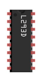
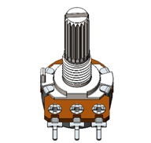
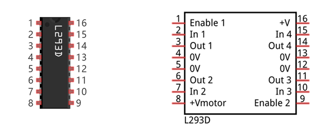
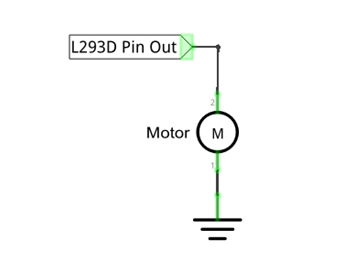
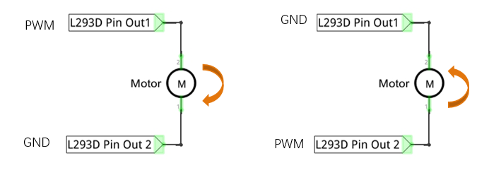
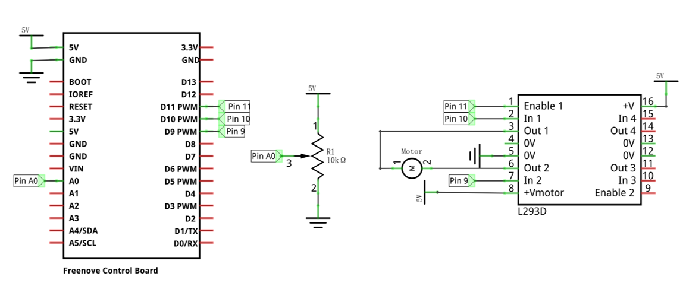
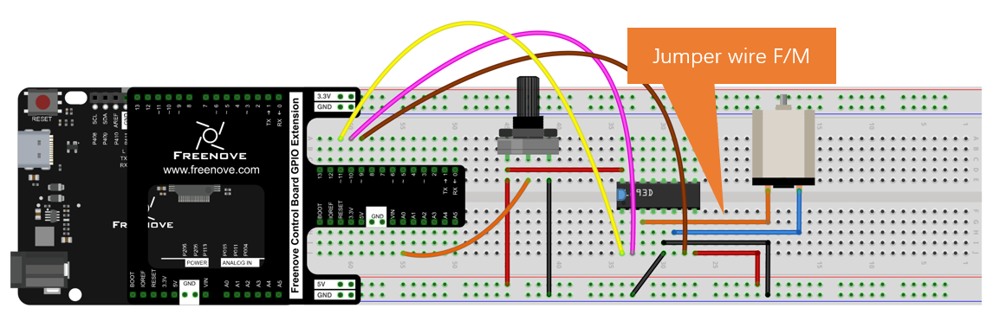

##############################################################################
Chapter Motor
##############################################################################

Earlier, we have done a series of interesting projects with control board and basic electronic components. Now, let us study some movable electronic modules. In this chapter, we will learn to control a motor.

Project Control Motor with L293D
***********************************************

Now, we will use dedicated chip L293D to control the motor.

Component List
===========================

.. table::
    :align: center

    +------------------------------------------------------+
    | Control board x1                                     |
    |                                                      |
    | |Chapter01_00|                                       |
    +--------------------------+---------------------------+
    | Breadboard x1            | GPIO Extension Board x1   |
    |                          |                           |
    | |Chapter02_00|           | |Chapter02_01|            |
    +------------------+-------+---------------------------+
    | USB cable x1     | Jumper M/M x10                    |
    |                  |                                   |
    |                  | Jumper F/M x2                     |
    |                  |                                   |
    | |Chapter01_02|   | |Chapter01_03|                    |
    +------------------+-----------------+-----------------+
    | Motor x1         | L293D x1        | Rotary          |
    |                  |                 |                 |
    |                  |                 | potentiometer x1|
    |                  |                 |                 |
    | |Chapter13_19|   | |Chapter13_20|  |  |Chapter13_21| |
    +------------------+-----------------+-----------------+

Component Knowledge
=========================

L293D
-----------------------

L293D is an IC chip (Integrated Circuit Chip) with a 4-channel motor drive. You can drive a unidirectional DC motor with 4 ports or a bi-directional DC motor with 2 ports or a stepper motor (stepper motors are covered later in this Tutorial).

Port description of L293D module is as follows:

.. table::
    :align: center
    :class: freenove-ow

    +----------+--------------+---------------------------------------------------------------------------------------------------------------+
    | Pin name | Pin number   | Description                                                                                                   |
    +==========+==============+===============================================================================================================+
    | In x     | 2, 7, 10, 15 | Channel x digital signal input pin                                                                            |
    +----------+--------------+---------------------------------------------------------------------------------------------------------------+
    | Out x    | 3, 6, 11, 14 | Channel x output pin, input high or low level according to In x pin, get connected to +Vmotor or 0V           |
    +----------+--------------+---------------------------------------------------------------------------------------------------------------+
    | Enable1  | 1            | Channel 1 and channel 2 enable pin, high level enable                                                         |
    +----------+--------------+---------------------------------------------------------------------------------------------------------------+
    | Enable2  | 9            | Channel 3 and channel 4 enable pin, high level enable                                                         |
    +----------+--------------+---------------------------------------------------------------------------------------------------------------+
    | 0V       | 4, 5, 12, 13 | Power cathode (GND)                                                                                           |
    +----------+--------------+---------------------------------------------------------------------------------------------------------------+
    | +V       | 16           | Positive electrode (VCC) of power supply, supply voltage 4.5~36V                                              |
    +----------+--------------+---------------------------------------------------------------------------------------------------------------+
    | +Vmotor  | 8            | Positive electrode of load power supply, provide power supply for the Out pin x, the supply voltage is +V~36V |
    +----------+--------------+---------------------------------------------------------------------------------------------------------------+

For more details, please see datasheet.

When using L293D to drive DC motor, there are usually two kinds of connection.

The following connection option uses one channel of the L239D, which can control motor speed through the PWM, However the motor then can only rotate in one direction.

The following connection uses two channels of the L239D: one channel outputs the PWM wave, and the

other channel connects to GND, therefore you can control the speed of the motor. When these two channel

signals are exchanged, not only controls the speed of motor, but also can control the steering of the motor.

In practical use the motor is usually connected to channel 1 and by outputting different levels to in1 and in2 to control the rotational direction of the motor, and output to the PWM wave to Enable1 port to control the motor's rotational speed. If the motor is connected to channel 3 and 4 by outputting different levels to in3 and in4 to control the motor's rotation direction, and output to the PWM wave to Enable2 pin to control the motor's rotational speed.

Circuit
=======================

Use pin A0 of the control board to detect the voltage of rotary potentiometer; pin 9 and pin 10 to control the motor's rotation direction and pin 11 to output PWM wave to control motor speed.

.. list-table:: 
   :align: center

   * -  Schematic diagram
   * -  |Chapter13_28|
   * -  Hardware connection 
     
        If you need any support, please feel free to contact us via: support@freenove.com

   * -  |Chapter13_29|

The DC electric power here can also be powered using 5V or 3.3V on the control board.

Sketch
========================

Sketch Control_Motor_by_L293D
--------------------------------------------------

Now, write the code to control speed and rotation direction of motor through rotary potentiometer. When the potentiometer stays in the middle position, motor speed will be minimum, and when deviates intermediate position, the speed will increase. Also, if the potentiometer deviates from the middle position of potentiometer clockwise or counterclockwise, the rotation direction of the motor is different.

.. literalinclude:: ../../../freenove_Kit/Sketches/Sketch_13.2.1_Control_Motor_by_L293D/Sketch_13.2.1_Control_Motor_by_L293D.ino
    :linenos: 
    :language: c
    :lines: 1-48
    :dedent:

In the code, we write a function to control the motor, and control the speed and steering through two parameters.

.. literalinclude:: ../../../freenove_Kit/Sketches/Sketch_13.2.1_Control_Motor_by_L293D/Sketch_13.2.1_Control_Motor_by_L293D.ino
    :linenos: 
    :language: c
    :lines: 36-48
    :dedent:

In the loop () function, detect the digital value of rotary potentiometer, and convert it into the motor speed and steering through calculation.

.. literalinclude:: ../../../freenove_Kit/Sketches/Sketch_13.2.1_Control_Motor_by_L293D/Sketch_13.2.1_Control_Motor_by_L293D.ino
    :linenos: 
    :language: c
    :lines: 22-34
    :dedent:

.. py:function:: abs(x)	
    
    Computes the absolute value of a number.

Verify and upload the code, turn the shaft of rotary potentiometer, and then you can see the change of the motor speed and direction. 